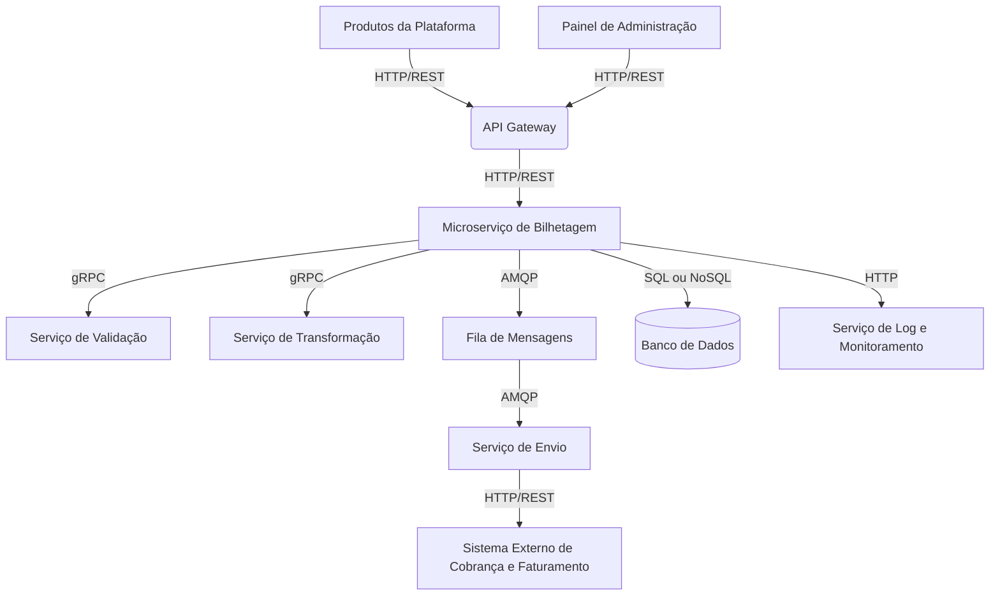

## Parte 3: Arquitetura e Projetos

caso não consiga visualizar o diagrama abra pelo link: https://bit.ly/4ez9QCV

### Componentes e Sistemas Externos

1. **Produtos da Plataforma**: Diversos produtos que geram dados de bilhetagem.
    - Comunicação: HTTP/REST para enviar dados ao API Gateway.

2. **API Gateway**: Ponto de entrada único para todos os clientes como Amazon API Gateway.
    - Funcionalidade: Roteamento, autenticação, controle de tráfego.
    - Comunicação: HTTP/REST para receber e encaminhar requisições.

3. **Microserviço de Bilhetagem**: Núcleo da solução, responsável por orquestrar o processamento dos dados.
    - Funcionalidade: Receber dados, coordenar validação e transformação, enfileirar para envio.
    - Comunicação:
        - HTTP/REST para receber dados do API Gateway.
        - gRPC para comunicação eficiente com serviços internos.
        - AMQP para enviar mensagens à fila.
        - SQL ou NoSQL para persistência de dados.
        - HTTP para envio de logs e métricas.

4. **Serviço de Validação**: Valida os dados recebidos.
    - Funcionalidade: Verificar integridade, formato e regras de negócio dos dados.
    - Comunicação: gRPC para receber requisições do microserviço principal.

5. **Serviço de Transformação**: Transforma os dados para o formato requerido pelo sistema externo.
    - Funcionalidade: Mapear e converter dados entre diferentes formatos.
    - Comunicação: gRPC para receber requisições do microserviço principal.

6. **Fila de Mensagens**: Armazena temporariamente os dados processados para envio assíncrono.
    - Funcionalidade: Garantir a entrega de mensagens, gerenciar picos de tráfego.
    - Comunicação: AMQP para receber e enviar mensagens.

7. **Serviço de Envio**: Consome mensagens da fila e envia ao sistema externo.
    - Funcionalidade: Retry logic, gerenciamento de falhas, confirmação de entrega.
    - Comunicação:
        - AMQP para consumir mensagens da fila.
        - HTTP/REST para enviar dados ao sistema externo.

8. **Sistema Externo de Cobrança e Faturamento**: Recebe os dados processados para faturamento.
    - Comunicação: HTTP/REST para receber dados do Serviço de Envio.

9. **Banco de Dados**: Armazena dados de bilhetagem, logs de transações e metadados.
    - Comunicação: SQL para operações de leitura e escrita.

10. **Serviço de Log e Monitoramento**: Coleta logs e métricas de todos os componentes.
    - Funcionalidade: Agregação de logs, alertas, dashboards de monitoramento.
    - Comunicação: HTTP para receber logs e métricas.

11. **Painel de Administração**: Interface para gerenciamento e monitoramento do sistema.
    - Funcionalidade: Visualização de métricas, configuração de regras, gerenciamento de usuários.
    - Comunicação: HTTP/REST para interagir com o sistema via API Gateway.

### Escolha de Infraestrutura

Para esta solução, recomendo uma infraestrutura em nuvem (cloud) pelos seguintes motivos:

1. **Escalabilidade**: Serviços em nuvem permitem escalar horizontalmente e verticalmente conforme a demanda, essencial para lidar com picos de tráfego.

2. **Disponibilidade**: Provedores de nuvem oferecem alta disponibilidade e redundância geográfica, cruciais para um sistema de bilhetagem.

3. **Gerenciamento simplificado**: Serviços gerenciados para bancos de dados, filas de mensagens e monitoramento reduzem a carga operacional.

4. **Segurança**: Provedores de nuvem oferecem recursos avançados de segurança e conformidade.

5. **Custo-benefício**: Modelo de pagamento por uso permite otimizar custos baseado na demanda real.

6. **Integração**: Facilita a integração com outros serviços e APIs, incluindo o sistema externo de cobrança.

7. **Disaster Recovery**: Facilita a implementação de estratégias de backup e recuperação de desastres.